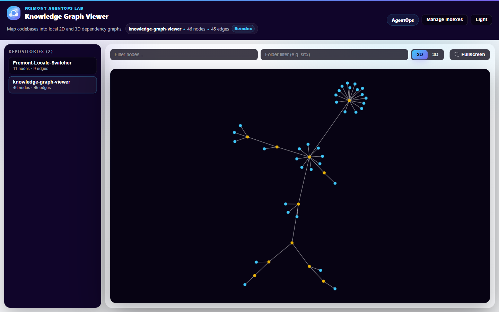
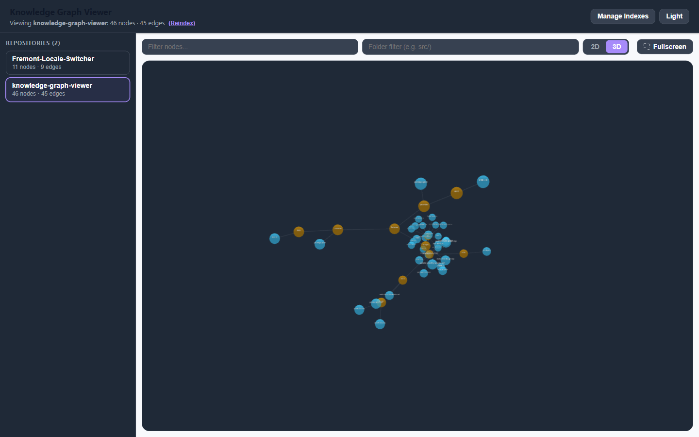
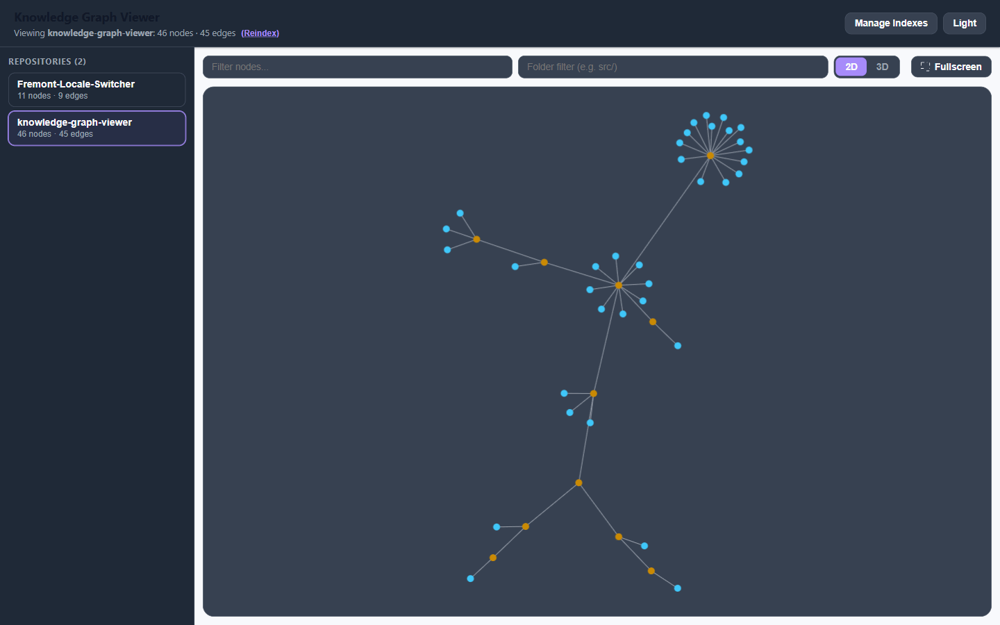

# Knowledge Graph Viewer

Local 2D/3D viewer for [Graphify](https://www.npmjs.com/package/@sentropic/graphify) knowledge graphs. Explore code structure, search symbols, and inspect node metadata in your browser.

[](LICENSE)

## Preview

| 2D | 3D |
| --- | --- |
|  |  |



## Quick start

```bash
git clone https://github.com/FremontGlobalSolutions/Fremont-Knowledge-Graph.git
cd Fremont-Knowledge-Graph
npm install
npm run dev
```

Open **http://localhost:5199**.

1. **Manage Indexes** → set your **workspace root** (folder containing git repos)
2. **Build Index** on repos you want to explore (requires [Graphify](https://www.npmjs.com/package/@sentropic/graphify) — `npx @sentropic/graphify update <repo>` works too)
3. **Sidebar Repositories** → choose which indexed repos appear in the left pane, then **Save Sidebar**
4. Select a repo → use **2D / 3D**, search, folder filter, and the node inspector

### Local config

Copy `.viewer-config.example.json` to `.viewer-config.json` to persist workspace and sidebar settings:

```json
{
  "workspaceRoot": "C:\\src",
  "visibleRepos": ["my-app", "my-library"]
}
```

Only repos listed in `visibleRepos` show in the sidebar — indexed repos you omit stay hidden.

## Features

- **2D and 3D** force-graph rendering
- **Workspace-aware** repo discovery and indexing from the UI
- **Configurable sidebar** — show only the repos you care about
- **Search and folder filters** on large graphs
- **Node inspector** with neighbors and metadata
- **Light / dark** theme
- **Drag-and-drop** or file picker to load any Graphify `graph.json`

## Requirements

- Node.js 18+
- Graphify for indexing (`graphify update` or `npx @sentropic/graphify update`)
- Windows/macOS/Linux: bundled reindex script uses Node.js (`scripts/update-graphify-graphs.mjs`)

## Production build

```bash
npm run build
npm run preview
```

## Troubleshooting

| Issue | Fix |
| --- | --- |
| Empty sidebar | Open **Manage Indexes** → check **Sidebar Repositories** → **Save Sidebar** |
| Repo not listed | Confirm it is a folder under your workspace root |
| No graph loaded | Build an index first (`graphify-out/graph.json` must exist) |
| Slow 3D on large graphs | Use 2D mode or filter by folder first |

## License

[MIT](LICENSE) © Fremont Global Solutions

## Built with AgentOps

Developed alongside [Fremont AgentOps](https://fremontagentops.com) — agent-native tooling for understanding and operating on real codebases.
